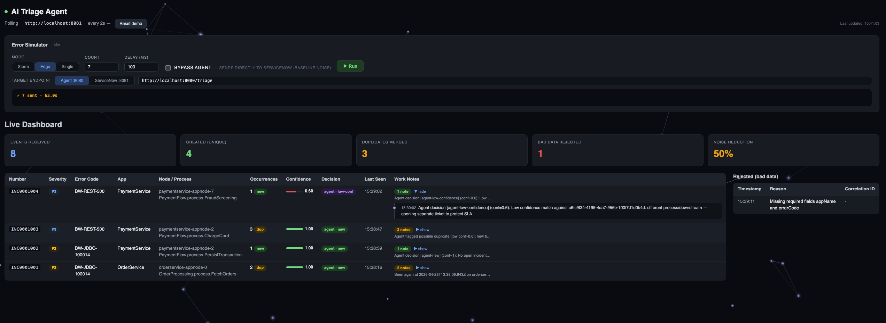

# Demo: AI-Powered ServiceNow Ticket Triage for BW6 Incidents

## 🎯 Demo Goal
Show how a **Flogo AI Agent** intercepts TIBCO BusinessWorks 6 Container Edition error events, decides whether each is a **new incident**, a **duplicate**, or **bad data**, and acts on a **mock ServiceNow** accordingly — reducing ticket noise by ~80–90%.

---

## 🎬 Narrative

> A TIBCO customer runs 40+ BW6 CE apps on Kubernetes. Every BW6 process fault — JDBC timeout, JMS reconnect loop, REST 5xx, OOM — becomes a ServiceNow ticket. On a bad day that's 500+ tickets, ~80% redundant. Flogo + an AI Agent cuts that noise to only the meaningful, unique incidents.

---

## 🧩 Components

| # | Component | Tech | Role |
|---|-----------|------|------|
| 1 | **BW6 Error Simulator** | `bw6-error-simulator.flogo` | Emits realistic BW6 CE error events |
| 2 | **Mock ServiceNow** | `mock-servicenow.flogo` | REST API: `POST/GET/PATCH /incidents` |
| 3 | **Triage AI Agent** | `bw6-ticket-triage-agent.flogo` | Agentic AI connector + LLM + tools |
| 4 | **Dashboard (optional)** | Static HTML | Live view of events vs. tickets |

---

## 🔥 Mock BW6 Error Catalog

| ID | BW6 Error | Activity | Cause |
|----|-----------|----------|-------|
| E1 | `BW-JDBC-100014` JDBC connection timeout | `JDBCQuery` | DB pool exhausted |
| E2 | `BW-JMS-200012` JMS reconnect loop | `JMSReceiver` | EMS broker down |
| E3 | `BW-REST-500` Downstream 5xx | `InvokeRESTService` | Partner API outage |
| E4 | `BW-CORE-OOM` OutOfMemoryError | AppNode | Memory leak |
| E5 | `BW-HTTP-404` Bad route | `HTTPReceiver` | Wrong client path |
| E6 | `BW-XML-PARSE` Malformed payload | `ParseXML` | Upstream bad data |

Event payload fields: `timestamp, appName, appNode, processName, activityName, errorCode, errorMsg, stackTrace, correlationId, severity`.

---

## 🌊 Demo Flow (5 acts)

### Act 1 — Baseline "noise problem" (~60s)
Storm mode: 50 events in 30s → 3 unique, 45 duplicates, 2 bad-data.
Without agent: **50 tickets**.

### Act 2 — Enable Triage Agent (~30s)
Toggle routing through the AI Agent flow. Re-run the storm.

### Act 3 — Agent reasons (~90s)
For each event the agent:
1. **Validates** payload (rule) → bad-data rejected.
2. **Embeds/searches** recent open incidents (last 60 min).
3. **LLM judges** top-K candidates and returns strict JSON:
   ```json
   { "decision": "DUPLICATE_OF", "ticketId": "INC00042", "confidence": 0.92, "reason": "Same JDBC-100014 on OrderService within 4 min" }
   ```
4. **Acts** via tools: `create_incident` | `append_occurrence` | `reject_bad_data`.

Result: **3 created, 45 merged, 2 rejected** — ~94% noise reduction.

### Act 4 — Sneaky new one (~45s)
Same `BW-JDBC-100014` but different app (`PaymentService` vs `OrderService`) → agent correctly classifies as **NEW**. Shows semantic reasoning beyond naive code matching.

### Act 5 — Human-in-the-loop (~30s)
Low-confidence case (<0.75): agent creates new ticket but attaches *"possible duplicate of INC00042"* suggestion. Protects P1 flows.

---

## 🛠️ App Designs

### `mock-servicenow.flogo`
REST endpoints mirroring ServiceNow shape:
- `POST   /api/now/incident`
- `GET    /api/now/incident?active=true&u_error_code=...&u_app_name=...`
- `GET    /api/now/incident/{id}`
- `PATCH  /api/now/incident/{id}` (append work note, increment `u_occurrence_count`)

In-memory store. Incident JSON fields: `sys_id, number, short_description, description, state, severity, u_error_code, u_app_name, u_app_node, u_process_name, u_occurrence_count, opened_at, work_notes[]`.

### `bw6-error-simulator.flogo`
- REST trigger `POST /simulate` with `{ mode: "storm"|"single"|"edge", count: N }`
- Randomizes from error catalog → publishes to agent via HTTP (or Kafka).

### `bw6-ticket-triage-agent.flogo`
Flow:
1. `ValidatePayload` (rule-based)
2. `BuildSignature`
3. `SearchRecentIncidents` → mock ServiceNow
4. **Agentic AI activity** with tools: `create_incident`, `append_occurrence`, `reject_bad_data`, `fetch_incident`
5. `RouteOnDecision`
6. `AuditLog`

---

## 🎛️ Agent Prompt Skeleton

```
SYSTEM:
You are a ServiceNow triage agent for TIBCO BusinessWorks 6 Container Edition incidents.
Decide whether an incoming BW6 error is NEW, DUPLICATE_OF an open incident, or BAD_DATA.

Rules:
- Duplicate only if same errorCode family AND same appName AND (same processName OR same appNode) AND within 15 min of an open incident.
- Different appName => NEW, even if errorCode matches.
- Missing/garbled required fields (errorCode, appName, timestamp) => BAD_DATA.
- If confidence < 0.75, prefer NEW and attach a "possible duplicate" note.
- Never auto-merge into a P1/Critical ticket.

Return strict JSON:
{ "decision": "NEW"|"DUPLICATE_OF"|"BAD_DATA",
  "ticketId": "<sys_id or null>",
  "confidence": 0.0-1.0,
  "reason": "<one sentence>" }
```

---

## 📊 Live Metrics



| Metric | Baseline | With Agent |
|--------|----------|------------|
| Events ingested | 50 | 50 |
| Tickets created | 50 | 3 |
| Duplicates merged | 0 | 45 |
| Bad data rejected | 0 | 2 |
| **Noise reduction** | — | **~94%** |

---

## 🚀 Build Order

1. `mock-servicenow` — smallest, unblocks everything
2. BW6 error catalog JSON
3. `bw6-error-simulator`
4. `bw6-ticket-triage-agent` — core value
5. Optional HTML dashboard
6. Demo script / talk track
